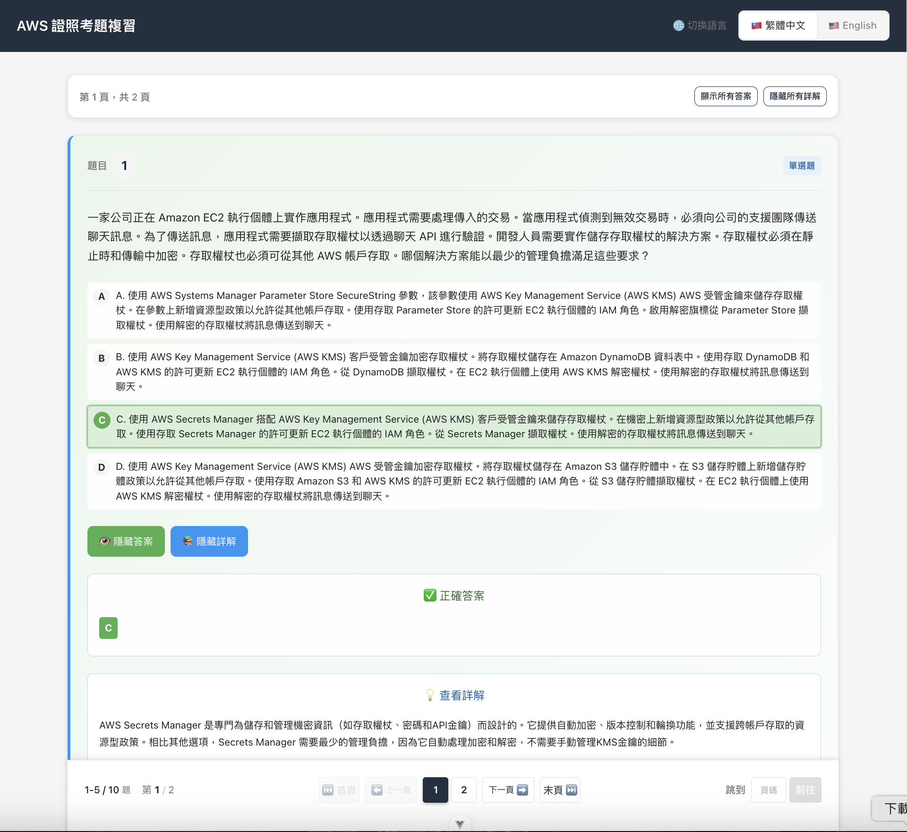
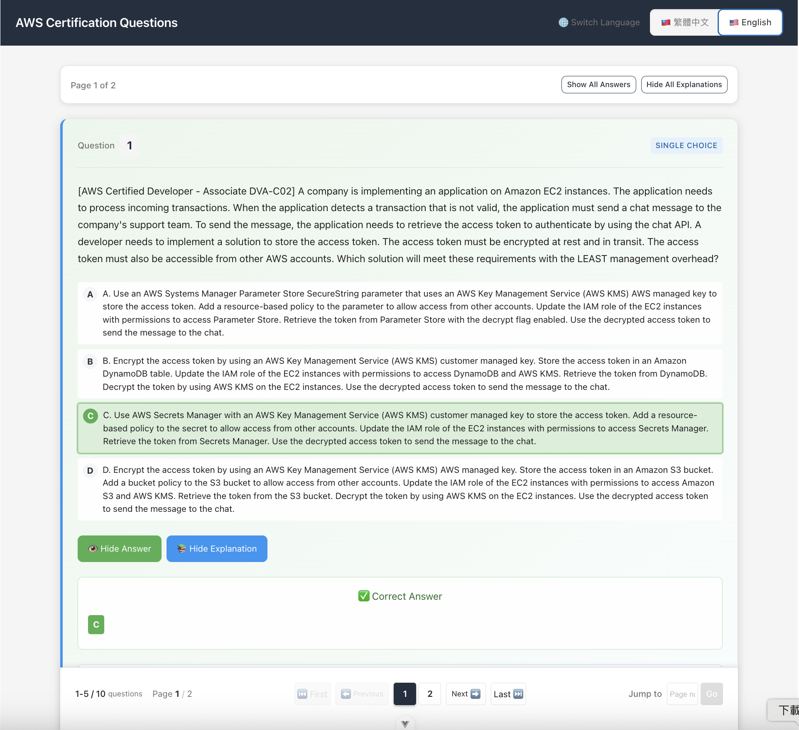

<div align="center">

**嘗試使用 GitHub Spec-Kit 進行規格驅動開發（Spec-Driven Development, SDD）**

**與自從 GenAI 火熱起來後社群文化非常流行的 Vibe Coding 進行使用上的差異比較**

**以及記錄 Vibe Coding、SDD、TDD 的概念**

</div>

## 聲明

本專案為個人學習與實踐紀錄，旨在：

- **探索** AI 輔助開發的不同方法論
- **比較** Vibe Coding 與 SDD 的實際使用體驗
- **記錄** 實作過程中的觀察與心得

內容基於個人有限的實作經驗，僅供參考使用。

---

## 目錄

- [氛圍式編碼 (Vibe Coding)](#vibe-coding-氛圍式編碼)
  - [是什麼？](#什麼是-vibe-coding)
  - [優點](#vibe-coding-優點)
  - [缺點](#vibe-coding-缺點)
- [規格驅動開發 (SDD)](#sdd-規格驅動開發)
  - [核心概念](#sdd-核心概念)
  - [SDD vs Vibe Coding](#sdd-vs-vibe-coding-對比)
  - [SDD vs TDD](#sdd-vs-tdd-對比)
- [GitHub Spec Kit 實作](#github-spec-kit-實作)
  - [實作步驟](#實作步驟)
  - [成果展示](#成果展示)
- [實作心得](#實作心得)
  - [Vibe Coding](#vibe-coding)
  - [Spec Kit (SDD)](#spec-kit)
  - [兩種方法的使用時機](#使用時機)
  - [AI 輔助開發的可能情境](#ai-輔助開發的可能情境)

---

## Vibe Coding 氛圍式編碼

### 什麼是 Vibe Coding

**Vibe Coding** 不是一個正式的 Computer Science 術語，比較像是社群文化。大意是：用白話文或直覺性的「感覺（Vibe）」來告訴 AI 你想要實現的功能、效果或設計。

#### 典型場景

| 範例 | 說明 |
|---------|---------|
| 開個 VSCode，寫邏輯、調效果 | 不是要 deliver feature，是享受 flow 狀態 |
| 不先寫 spec，直接做原型 | 不把問題拆太細，先動手感受 |
| 偏向草稿的程式開發 | 不是寫 production code，是 sketching code |

> **核心理念**：這不是技術術語，而是一種 **Coding 心態 / 工作 Flow**。先拋開嚴謹的程式架構，邊做邊產生想法。

#### 為什麼流行？

1. **GenAI Coding 模式出現後「先動手 → 再 refine」變超有效**
2. 享受用「需求描述」的方式寫程式
3. 給模型一句 prompt → AI 輸出 code → 測試 → 調整 prompt → 迭代優化
4. 比起「先花 X 天寫 PRD」更快看到產品雛形

> **一句話總結**：Vibe Coding = Coding as Creative Flow，不是 Coding as 執行任務

### Vibe Coding 優點

| 優勢 | 說明 |
|---------|---------|
| **低技術門檻** | 一般人也能開發，不用精通程式，用講的就能寫出簡單應用 |
| **加速原型開發** | 速度快，適合快速建構 MVP 或測試新點子 |
| **試錯成本低** | 快速產出產品原型，測試和修改成本相對較低 |

### Vibe Coding 缺點

雖然有它的「爽感」，但以正式產品角度來說很危險：

#### 主要問題

1. **很容易變成丟棄式程式碼**
   - 不是先定 spec，也沒有邏輯分層
   - 寫起來像草圖：不好拆 component、難 refactor、難擴充

2. **大部分 Vibe Code 只能 demo 不能上 production**

3. **決策品質低、偏異程度高**
   - 靠「感覺」容易限縮於單點功能
   - 會忽略 edge case / failure mode

4. **Debug 惡夢**
   - 通常直接把變數丟來丟去，局部錯誤很難回溯
   - AI 短時間寫大量程式碼，錯誤難以修正

5. **Knowledge 不會被沉澱**
   - 沒有用 spec 記錄規格與需求
   - 後人難以接手，只能繼續「AI 即興發揮」

> **結論**：Vibe Coding 是 Prototype 加速器，不是 Delivery 正式產品的系統。只適合「需求還沒被固定」的階段。

來自社群的梗圖


資訊工程師：(吐一口放鬆的氣) 看來我還能活一陣子

---

## SDD 規格驅動開發

### SDD 核心概念

**Spec-Driven Development (SDD)** 是一種軟體開發方法論，在 AI 輔助程式設計的時代中變得更重要。

#### 核心思想

1. **規格先行，程式碼在後**
   > 寫程式碼之前，先創建清晰、結構化且可測試的「規格」(Specification)

2. **規格即真理的來源 (Source of Truth)**
   > 規格文件詳細描述 **「要做什麼」(What) 以及「為什麼做」(Why)**

3. **AI 代理的藍圖**
   > 規格成為 AI 編碼工具生成、測試和驗證的主要合約

#### SDD 帶來的效益

| 效益 | 原因 |
|---------|---------|
| **溝通成本降低** | 全部角色共同參考單一 Source of Truth |
| **Code 可自動生成** | AI 看得懂，有 spec 就能產 code |
| **測試案例容易撰寫** | Spec 定義行為，test case 直接對齊 spec |
| **AI Agent 容易對齊** | Spec 明確，最適合作為 AI 的 input |

> **核心理念**：不是先寫 Code 再補文件，是先有規格 → 再寫 Code → Code 無法偏離規格約束

### SDD vs Vibe Coding 對比

<table>
<tr>
<th>特點</th>
<th>SDD</th>
<th>Vibe Coding</th>
</tr>
<tr>
<td><strong>核心精神</strong></td>
<td><strong>意圖即真理</strong><br/>以清晰、結構化的規格為最高依據</td>
<td><strong>流程即自由</strong><br/>依賴開發者直覺和 AI 即時輸出</td>
</tr>
<tr>
<td><strong>程式碼角色</strong></td>
<td><strong>規格的執行結果</strong><br/>程式碼是可替換的自動生成產物</td>
<td><strong>思考的過程</strong><br/>程式碼即時生成，較混亂難追蹤</td>
</tr>
<tr>
<td><strong>品質標準</strong></td>
<td><strong>高且可驗證</strong><br/>程式碼必須追溯回規格驗收標準</td>
<td><strong>不穩定且參差不齊</strong><br/>品質依賴 Prompt 品質和 AI「心情」</td>
</tr>
<tr>
<td><strong>流程主導者</strong></td>
<td><strong>規格文件 (Spec)</strong><br/>驅動計劃、任務拆解、程式碼生成</td>
<td><strong>人類提示詞</strong><br/>缺乏結構和嚴謹規劃</td>
</tr>
<tr>
<td><strong>人類角色</strong></td>
<td><strong>設計師與架構師</strong><br/>專注定義意圖、架構設計和審核</td>
<td><strong>操作者與修復者</strong><br/>專注快速迭代和修復錯誤（極度痛苦）</td>
</tr>
<tr>
<td><strong>適用場景</strong></td>
<td><strong>品質、可維護性、可擴展性</strong><br/>複雜、企業級、長期維護專案</td>
<td><strong>速度、創意、原型製作</strong><br/>快速原型、概念驗證和個人實驗</td>
</tr>
<tr>
<td><strong>主要痛點</strong></td>
<td>前期投入時間長<br/>必須先寫好結構化規格</td>
<td><strong>技術債務高昂</strong><br/>難以在生產環境維護和除錯</td>
</tr>
</table>

### SDD vs TDD 對比

| TDD | SDD |
|--------|--------|
| Test 驅動 Code | Spec 驅動 Code |
| Test 是實現層 | Spec 是行為約束 |
| Test 主張微觀層次約束 | Spec 主張宏觀層次約束 |

> **SDD 一句話總結**：用可執行規格當源頭 → Code 只是實現 Spec 的產物

---

## GitHub Spec Kit 實作

### 參考資源

- [官方 Spec Kit](https://github.com/github/spec-kit)
- [中文 Spec Kit](https://github.com/doggy8088/spec-kit)
- 實作工具：Claude Code

### 實作步驟

#### 1. 建立專案原則

```bash
/speckit.constitution 建立以下準則
    1. 一律使用繁體中文
    2. 重視程式碼品質，使用者體驗一致性
    3. 設計最小可行產品 MVP，不要過度設計
```

產生：`spec-kit-aws-question-web/.specify/memory/constitution.md`

#### 2. 建立規格

> Spec Kit 會自動使用 Git 建立新分支，功能驗證後可 merge 回主分支

```bash
/speckit.specify 建立一個試題網頁方便 AWS 證照考生複習考題
    1. 具有中英文切換功能，每道題目一個區塊
    2. 答案、選項、詳解子區塊可摺疊隱藏
    3. 具有分頁功能，每頁顯示五題
    4. 固定底部導航列，不隨頁面滾動
    5. 試題使用 @question.json
```

產生檔案：
- `specs/001-aws-exam-web/checklists/requirements.md`
- `specs/001-aws-exam-web/spec.md`

#### 3. 釐清未明確定義

```bash
/speckit.clarify
```

Claude 會互動式澄清規格模糊地帶

#### 4. 建立技術實作計畫

```bash
/speckit.plan
    1. 使用 Vue3.js, Scss, TypeScript
    2. 前端建構工具使用 Vite
    3. 不需要後端，題庫來源使用 @questions.js
    4. 盡量減少額外 Library 依賴
```

產生檔案：
- `specs/001-aws-exam-web/plan.md`
- `specs/001-aws-exam-web/research.md`
- `specs/001-aws-exam-web/quickstart.md`
- `specs/001-aws-exam-web/data-model.md`
- `specs/001-aws-exam-web/contracts/api.ts`
- `specs/001-aws-exam-web/contracts/types.ts`

#### 5. 任務拆解

```bash
/speckit.tasks
```

#### 6. 分析一致性與覆蓋度

```bash
/speckit.analyze
```

#### 7. 執行實作

```bash
/speckit.implement
```

### 最終規格資料夾結構

```
├── spec-kit-aws-question-web/.specify
│   └── memory
│       └── constitution.md
└── specs
    └── 001-aws-exam-web
        ├── checklists
        │   └── requirements.md
        ├── contracts
        │   ├── api.ts
        │   └── types.ts
        ├── data-model.md
        ├── plan.md
        ├── quickstart.md
        ├── research.md
        ├── spec.md
        └── tasks.md
```

### 成果展示

#### 中文版本
<div align="center">

</div>

#### 英文版本
<div align="center">

</div>

---

## 實作心得

### Vibe Coding
- 優點
    - **速度快**：簡單幾句話，AI 代理就生成了想要的功能
    - **創意流暢**：適合探索性開發，可以快速驗證想法

- 缺點
    - **難以一次到位**：過程需要不斷與 AI 溝通調整功能需求
    - **Debug 負擔重**：經常需要幫 AI 修正錯誤或手動介入
    - **容易陷入無限迴圈**：AI 有時會持續產生錯誤，無法收斂到正確解
    - **需要高品質 Prompt**：要讓 AI 初始就進入狀況，反而需要事先準備詳細描述

### Spec Kit
- 優點
    - **流程標準化**：依照步驟即可產生完整規格，非常方便
    - **規格品質高**：產出的規格非常詳細，涵蓋面廣
    - **AI 輔助釐清**：在 `clarify` 過程中，AI 會主動提出不同面向的需求衝突並協助釐清
    - **實作準確度高**：完成後幾乎達到描述的功能，雖然仍有 bug 但修正次數大幅減少
    - **不易偏離目標**：修正過程會持續參考既有規格，確保開發方向正確

- 缺點
    - **時間投入較長**：相比 Vibe Coding 的 15 分鐘，SDD 需要至少 1 小時
    - **需要深度思考**：過程中也需要自己釐清規格，不能完全依賴 AI

- 價值
    - **知識沉澱**：規格文件可作為未來維護或擴充的依據
    - **設計可追溯**：清楚記錄當初的設計決策和原因
    - **品質控管**：會自動建立單元測試，規定成功率達標才算完成

> **觀察**：雖然 SDD 前期投入較多，但考慮到 Vibe Coding 的 Debug 時間，**實際總開發時間相差不大**，而 SDD 在品質和可維護性上明顯勝出。

### 使用時機

#### 選擇 Vibe Coding 的時機
- **概念驗證階段**：快速驗證想法可行性
- **創意探索**：需要大量試錯和靈感激發
- **個人專案**：不需要長期維護的小型工具
- **學習新技術**：透過快速實作來理解概念

#### 選擇 SDD 的時機
- **正式產品開發**：需要長期維護和擴充的系統
- **團隊協作專案**：需要明確規格作為溝通基礎
- **複雜業務邏輯**：有多個 edge case 需要考慮
- **企業級應用**：對品質和可靠性有高要求

### AI 輔助開發的可能情境
**混合式開發流程**：
   - 用 Vibe Coding 快速探索和原型製作
   - 用 SDD 進行正式開發和產品化

> **建議**：將 Vibe Coding 和 SDD 視為 **互補的開發工具**。在適當的時機選擇適當的方法，才能發揮 AI 輔助開發的最大價值。

---
